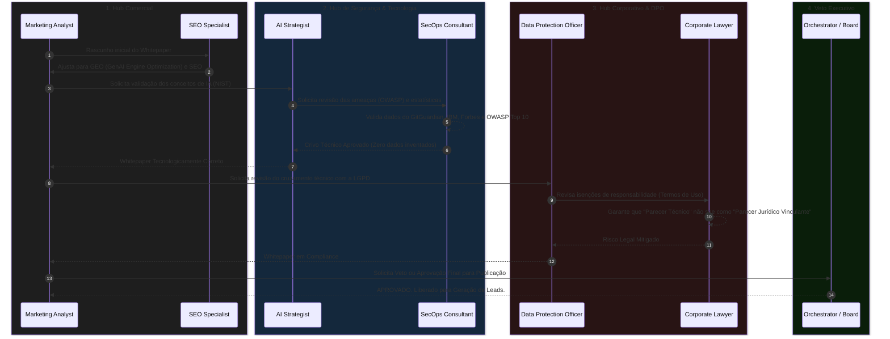

# Fluxo de Geração de Valor: Validação do Whitepaper CrIAr

Para garantir que o **Whitepaper "Adoção Segura de IA"** seja um material de altíssimo rigor técnico (não apenas mais um PDF de marketing vazio), ele deve ser processado pela mesma esteira de validação que usamos no desenvolvimento de software. 

Abaixo está o **Fluxo Multi-Hub** ilustrando como nossos Agentes Especialistas interagem para garantir que o documento gere valor real, seja tecnicamente irrefutável e blindado juridicamente.

---

## 🔄 A Esteira de Validação (Hub a Hub)

---

## 🕵️ O Papel de Cada Agente no Processo

### Passo 1: Tração e Posicionamento (Hub Comercial)
* **`marketing-analyst`**: Define a narrativa (A dor do "Vibe Coding", a empatia com os psicólogos, a solução CrIAr). Formata o documento na estética *Navy Confidence* da empresa.
* **`seo-specialist`**: Garante que os títulos, capítulos e o glossário contenham semântica ideal para que os motores de busca e novos LLMs corporativos encontrem o documento quando CTOs buscarem por *"frameworks nist brasil LGPD adoção"*.

### Passo 2: Rigor Técnico (Hub de Segurança e Tech)
* **`ai-strategist`**: Verifica se o entendimento prático do framework NIST AI RMF está traduzido corretamente e não apenas copiado e colado. 
* **`secops-consultant`**: Atua como o "policial da estatística". Sua regra é tolerância zero para dados inventados. É ele quem confirma os números do *GitGuardian* sobre vazamentos e a *OWASP LLM01:2025* sobre Injeção de Prompts.

### Passo 3: Blindagem de Compliance (Hub Corporativo)
* **`dpo`**: Analisa as afirmações sobre telepsicologia, prontuários digitais e dados sensíveis, garantindo que o método da CrIAr descrito no whitepaper cumpra estritamente os anseios da ANPD.
* **`corporate-lawyer`**: Realiza uma leitura focada em *liability* (responsabilização civil). Ele adiciona um pequeno aviso isentando a CrIAr de atuar como escritório de advocacia, confirmando o papel do documento como uma **sugestão arquitetural técnica**, protegendo a empresa contra processos interpretativos de terceiros.

### Passo 4: Lançamento (Hub Executivo)
* **`orchestrator`**: O tom de voz condiz com a marca institucional da "CrIAr Consulting"? As imagens usadas são próprias? Com isso validado, a tag de revisão é removida e a distribuição via Flywheel de Conteúdo B2B (MQLs) é disparada.

---

> [!TIP]
> **Vantagem deste Fluxo**
> Ao fazer um documento atravessar intencionalmente essas 4 zonas de fricção, garantimos que o Output Final seja o padrão ouro do mercado. Clínicas e C-Levels percebem a densidade dessa revisão transversal ao lerem o sumário técnico. O material para de ser "um artigo de blog que virou PDF" e torna-se genuinamente **um documento de consultoria de alto ticket.**
