# 🏢 Organograma Estrutural — CrIAr Consulting

Este documento apresenta a estrutura organizacional completa da **CrIAr Consulting**, mapeando os **51 agentes especialistas** que compõem nosso ecossistema de Inteligência Artificial. A estrutura foi concebida para suportar operações escaláveis B2B em consultoria de TI, desenvolvimento nativo, governança de segurança cibernética e adoção de IA.

---

## 📊 Visão Geral da Arquitetura Organizacional

A CrIAr Consulting está organizada em **6 Hubs Estratégicos e Operacionais**. 

```mermaid
graph TD
    %% Hubs Definitions
    style CEO fill:#2c3e50,stroke:#2c3e50,color:#fff,stroke-width:2px
    style CISO fill:#8e44ad,stroke:#8e44ad,color:#fff,stroke-width:2px
    style COMMERCIAL fill:#27ae60,stroke:#27ae60,color:#fff,stroke-width:2px
    style TECH fill:#2980b9,stroke:#2980b9,color:#fff,stroke-width:2px
    style PRODUCT fill:#d35400,stroke:#d35400,color:#fff,stroke-width:2px
    style CORP fill:#f39c12,stroke:#f39c12,color:#fff,stroke-width:2px

    CEO[Hub Executivo & Estratégia] --> COMMERCIAL[Hub Comercial & Novos Negócios]
    CEO --> CISO[Hub de Segurança da Informação]
    CEO --> TECH[Hub de Tecnologia & Engenharia]
    CEO --> PRODUCT[Hub de Produto & Entrega]
    CEO --> CORP[Hub Corporativo & Backoffice]

    %% Commercial Hub
    COMMERCIAL --> AE(Account Executive)
    COMMERCIAL --> SDR(SDR / BDR)
    COMMERCIAL --> SE(Solutions Engineer)
    COMMERCIAL --> MKT(Marketing Analyst)

    %% Security Hub
    CISO --> SEC_ENG(Security Engineer)
    CISO --> SEC_ANA(Security Analyst)
    CISO --> GRC(GRC Analyst)
    CISO --> PT(Penetration Tester)
    CISO --> IR(Incident Responder)

    %% Tech Hub
    TECH --> TL(Tech Lead)
    TL --> FRONT(Frontend Specialist)
    TL --> BACK(Backend Specialist)
    TL --> MOBILE(Mobile Developer)
    TL --> DEVOPS(DevOps Engineer)
    TL --> DBA(Database Architect)

    %% Product & Delivery Hub
    PRODUCT --> PM(Product Manager)
    PM --> PO(Product Owner)
    PM --> PROJ_MGR(Project Manager)
    PROJ_MGR --> DM(Delivery Manager)
    PROJ_MGR --> QA(QA Automation)
    PROJ_MGR --> CS(Customer Success)

    %% Corporate Hub
    CORP --> DPO(DPO)
    CORP --> LEGAL(Jurídico & Compliance)
    CORP --> FIN(Controladoria & Finanças)
    CORP --> HR(Recursos Humanos)
```

---

## 🏛️ Hub Executivo & Estratégia
> **Responsabilidade:** Visão de longo prazo, orquestração corporativa e inovação tecnológica transversal.

- **`orchestrator`**: Mestre na coordenação multi-agente, analisando o panorama geral e delegando tarefas complexas para múltiplos domínios e disciplinas.
- **`ai-strategist`**: Estrategista focado em adoção segura e eficaz de IA para o corporativo e para os clientes da CrIAr.

---

## 💼 Hub Comercial & Novos Negócios
> **Responsabilidade:** Captação no mercado B2B, relacionamento técnico-comercial e posicionamento de marca. Liderado pelo **Commercial Director**.

| Agente Especialista | Foco |
| :--- | :--- |
| **`commercial-director`** | Liderança de vendas. Visão de funil, estratégia de precificação e arquitetura de contratos consultivos. |
| **`account-executive`** | Fechamento B2B, relacionamento e maturação do ciclo de vendas complexas. |
| **`sdr-bdr`** | Qualificação profunda de leads técnicos, Mapeamento de dores (ICP) e prospecção inicial. |
| **`solutions-engineer`** | Pré-vendas técnica. Desenho em alto nível de arquitetura para validar a viabilidade comercial. |
| **`marketing-analyst`** | Posicionamento de marca, produção técnica de conteúdo (flywheel b2b) e estratégia SEO inicial. |
| **`seo-specialist`** | Otimização de busca orgânica, E-E-A-T, Core Web Vitals e GEO (GenAI Engine Optimization). |

---

## 🛡️ Hub de Segurança da Informação
> **Responsabilidade:** Proteção de dados, gestão de risco corporativo, segurança operacional e prevenção contra ameaças sob a liderança de operações de risco e conformidade técnica. Liderado pelo **CISO**.

| Agente Especialista | Foco |
| :--- | :--- |
| **`ciso`** | Head estratégico de Segurança da Informação. Gestão de Risco, Roadmap, poder de Veto de Deploys e report direto ao CEO. |
| **`grc-analyst`** | Governança corporativa, auditoria, políticas e compliance contínuo (ISO 27001, LGPD/GDPR frameworks). |
| **`security-auditor`** | Verificações preventivas periódicas focadas em conformidade (SAST, DAST) do ambiente. |
| **`security-engineer`** | Implementação prática de controles arquiteturais e hardening (Firewalls, WAF, CI/CD Seguro). |
| **`security-analyst`** | Monitoramento constante (SIEM, EDR) e triagem de anomalias na fronteira digital da organização. |
| **`incident-responder`** | Ação emergencial de contenção, DFIR (Digital Forensics) e erradicação em cenários de violação severa ativa. |
| **`penetration-tester`** | Engenharia de Red Team e exploração pró-ativa de vulnerabilidades e vetores avançados (OWASP Top 10 + MITRE ATT&CK). |
| **`secops-consultant`** | Especialista em alinhamento entre DevOps, Cloud Operations e a Segurança no ciclo de vida de aplicações. |

---

## 💻 Hub de Tecnologia & Engenharia
> **Responsabilidade:** Core-business tecnológico da CrIAr, responsável pela sustentação, arquitetura técnica e inovação no desenvolvimento de software. Liderado pelo **Tech Lead**.

| Agente Especialista | Foco |
| :--- | :--- |
| **`tech-lead`** | Arquitetura técnica raiz. Tomada de decisões de design, escolha de *stack* e direcionamento estrutural (ADR). |
| **`frontend-specialist`** | Especialista em React, UI/UX, acessibilidade, interfaces interativas e performance cliente. |
| **`backend-specialist`** | Domínio sobre Node.js, Python, APIs REST/GraphQL/tRPC e lógica robusta de servidor corporativo. |
| **`mobile-developer`** | Desenvolvimento nativo cruzado em ecossistemas fechados iOS/Android e React Native/Flutter. |
| **`database-architect`** | Planejamento, modelagem e otimização pesada das estruturas relacionais e não-relacionais, e performance ORM. |
| **`devops-engineer`** | Automação extrema de deploy infra-as-code (Terraform), Dockerização, escalabilidade e gestão de pipelines CI/CD. |
| **`performance-optimizer`** | Dedicado a eliminar gargalos pontuais (Time-to-First-Byte, Core Web Vitals, Bundle Sizing, Caching). |
| **`code-archaeologist`** | Análise e refatoração profunda de legados, transição sistêmica com dívida técnica mínima. |
| **`game-developer`** | Desenvolvimento interativo voltado para lógicas sistêmicas baseadas em loops, simulações e engines próprias. |
| **`explorer-agent`** | Investigador sistêmico e leitor abrangente de codebases. Avaliador estrutural passivo. |

---

## 📦 Hub de Produto & Entrega
> **Responsabilidade:** Garantia de aderência de requisitos à regra de negócio, qualidade e ritmo de escoamento ao mercado (Velocity, Saúde da Conta, Suporte Continuado).

| Agente Especialista | Foco |
| :--- | :--- |
| **`product-manager`** | Visão macro de mercado, roadmap, rentabilidade e prioridades globais do produto ("Building the right thing"). |
| **`product-owner`** | Engenharia ágil de requisitos e BDD. Backlog refining (Épicos, Histórias de Usuário), focado na sprint tática. |
| **`business-analyst`** | Mapeamento corporativo da dor do negócio do cliente no lado B2B em linguagens acionáveis. |
| **`project-manager`** | Escopo, cronograma, agilidade pragmática, risco projeto-a-projeto. Ritos ágeis pragmáticos. |
| **`project-planner`** | Especialista em segmentação fria de tarefas (WBS). 4-Phase System Design sem escrever código, apenas fatiando o que deve ser feito. |
| **`delivery-manager`** | Saúde e SLA das filas de DevOps e Desenvolvimento. Garantir vazão com qualidade controlada na última milha de CI/CD. |
| **`customer-success`** | Analista de NPS, Churn, Onboarding Técnico do cliente corporativo e garantia de uso ativo contínuo da Solução. |
| **`implementation-specialist`** | Agente de transições. O braço especializado em acoplar o produto em arquiteturas do cliente no Go-Live. |
| **`qa-analyst`** | Garantia de qualidade exploratória de usabilidade. Executar auditoria de UX e validar os cenários em sandbox. |
| **`qa-automation-engineer`** | Engrenagem de automação Playwright/E2E e suítes integrativas. Não confia em teste manual. |
| **`test-engineer`** | Evangelizador do TDD, testes unitários exaustivos com padrões Pyramide de Testes e lógica "vermelho-verde-refatorado". |
| **`debugger`** | Investigador sênior para troubleshooting e forense local pós-incidente. Ex-post-mortems, análise de callstack obscura. |
| **`support-analyst`** | Triagem diária de Service Desk. Triage e escalonamento dos chamados com SLA no contexto de suporte de entrega técnica ITIL. |
| **`documentation-writer`** | Defesa passiva através da documentação (Manuais corporativos, ADRs legíveis, Readmes auto-explicativos). |

---

## 🏢 Hub Corporativo & Backoffice
> **Responsabilidade:** O escudo financeiro, jurídico e fiscal da CrIAr, necessário para sobreviver no ecossistema regulatório corporativo. Liderado por especializações financeiras e legais.

| Agente Especialista | Foco |
| :--- | :--- |
| **`dpo`** | Data Protection Officer. Oficial de Compliance LGPD focado na mitigação de risco civil de proteção e privacidade aos dados corporativos operados ou armazenados pela CrIAr. |
| **`corporate-lawyer`** | Advogado interno global para modelagens macroestruturais e segurança na elaboração geral para a empresa. |
| **`societary-lawyer`** | Especialidade focada em equity, arranjos de sociedade, reestruturações jurídicas complexas empresariais. |
| **`labor-lawyer`** | Gestão de Risco do passivo civil trabalhista aplicável à realidade de software (CLT, pejotização, passivo sistêmico). |
| **`paralegal-analyst`** | Suporte legal analítico na triagem, trâmites processuais e análise prévia de cláusulas documentais. |
| **`financial-controller`** | Controle corporativo mestre de finanças, DRE, planejamento econômico e caixa e governança (The "Controller"). |
| **`financial-analyst`** | Analista granular técnico de finanças de despesas corporativas no lado financeiro (Métrica SaaS DRE, FP&A). |
| **`accountant`** | Contabilidade focada em tributos. Gestor das regras de retenção em software (IRRF/CSRF), CPC/CFC Brasil. |
| **`billing-analyst`** | Automação e regularidade precisa operacional focada na governança do faturamento diário (NF-e B2B). |
| **`tax-analyst`** | Auditorias, obrigações acessórias tributárias brasileiras de serviços focados na TI B2B. |
| **`hr-admin-analyst`** | Sustentação do Departamento Pessoal e eSocial da empresa, infraestrutura burocrática para as squads. |

---

> 📝 **NOTA DE ATUALIZAÇÃO:** Este Organograma abrange e sumariza os agentes especialistas de suporte disponíveis no *Antigravity Kit* da empresa, alinhados com a padronização contínua de operações descrita no arquivo `PROJECT.md`.
